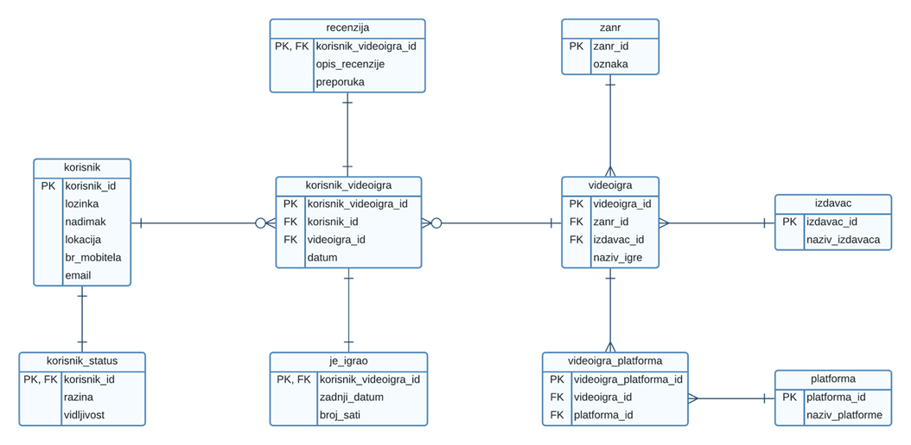
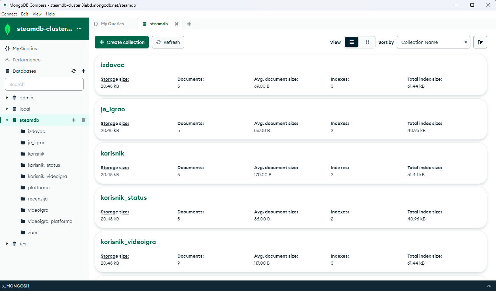
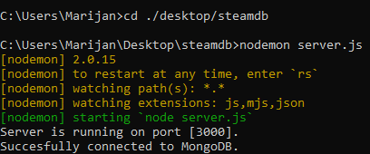
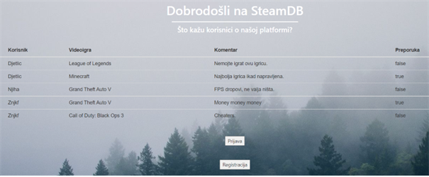
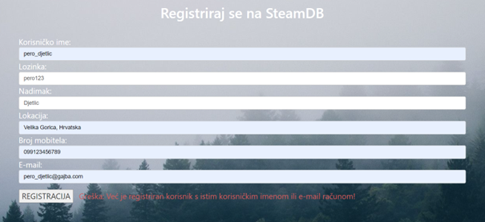
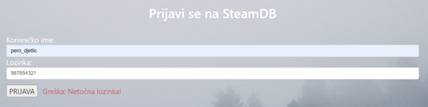

<a name="readme-top"></a>

<div align="right">
<a href="./README.en.md"></a>
</div>

<!-- INTRO --> 
<br />
<div align="center">
  
  

  <h3 align="center">Platforma za distribuciju videoigara</h3>

  <p align="center">
    Jednostavna web-aplikacija za interakciju sa MongoDB bazom podataka koristeći NodeJS. <br> Inspirirano servisom <a href="https://steamdb.info/">SteamDB</a> ✨
    <br /> 
    <a href="https://nastava.foi.hr/course/72610"><strong>Saznajte više »</strong></a>
    <br />

  </p>

  <br>
  
  <!-- TABLE OF CONTENTS -->

  <a href="#-uvod">Uvod</a> • 
  <a href="#-opis-projekta">Opis projekta</a> • 
  <a href="#-konfiguracija">Konfiguracija</a> • 
  <a href="#-upotreba">Upotreba</a> • 
  <a href="#-korišteni-alati">Korišteni alati</a>
</div>

<br>

<!-- ABOUT THE PROJECT -->
## 📖 Uvod

### Općenito

<table>
  <tbody>
    <tr>
      <td>👦🏽 Autor</td>
      <td>Marijan Kovač</td>
    </tr>
    <tr>
      <td>🧑🏽‍🏫 Nastavnik</td>
      <td>Prof. dr. sc. Kornelije Rabuzin</td>
    </tr>
    <tr>
      <td>📚 Kolegij</td>
      <td>Baze podataka 2</td>
    </tr>
    <tr>
      <td>🏛️ Ustanova</td>
      <td>Sveučilište u Zagrebu <br> Fakultet organizacije i informatike <br> Varaždin</td>
    </tr>
    <tr>
      <td>📆 Godina <br>polaganja</td>
      <td>2022</td>
    </tr>
  </tbody>
</table>

<p align="right">(<a href="#readme-top">povratak na vrh</a>)</p>

## 📝 Opis projekta

### Aplikacijska domena

Simulacija Steam
baze podataka, u obliku third-party web stranice pod nazivom SteamDB, koja služi
informiranju drugih korisnika o postojećim korisnicima, njihovim postignućima, videoigrama te
kolekcijama videoigara koje posjeduju.

### ERA model

Ključni entiteti:

* Korisnik
* Recenzija
* Videoigra
* Žanr
* Izdavač
* Platforma

Pomoćni entiteti:

* korisnik_videoigra
* korisnik_status
* je_igrao
* videoigra_platforma

<br>

ERA model:

<div align="center">
  <a href="./Documentation/images/Slika1.png"></a>
</div>

<br>

Za više detalja kliknite <a href="./Documentation/Platforma za distribuciju videoigara.pdf"><strong>ovdje</strong></a>.

<p align="right">(<a href="#readme-top">povratak na vrh</a>)</p>

## ⚙️ Konfiguracija

### Preduvjeti

Za pokretanje rješenja bit će vam potrebno sljedeće:

* MongoDB 

  ```
  👉🏽 Napomena: S obzirom da će zbog neaktivnosti moj klaster biti isključen, potrebno je kreirati vlastiti na način opisan u nastavku. Shemu nije potrebno kreirati ručno, važno je samo da naziv klastera i baze bude dosljedan kako bi sve bilo kompatibilno, dok se shema kreira automatski prilikom pokretanja skripte server.js, a također se vrši i popunjavanje inicijalnih podataka.
  ```

  * Posjetite <a href="https://www.mongodb.com/"><strong>MongoDB</strong></a> kako biste izradili korisnički račun

  * S kreiranim računom se prijavite na <a href="https://www.mongodb.com/atlas"><strong>MongoDB Atlas</strong></a>

    * Kliknite na `Create` i zatim odaberite `Shared` > `Create Cluster`

    * Naziv neka bude `steamdb-cluster`

  * Preuzmite i instalirajte <a href="https://www.mongodb.com/products/tools/compass"><strong>MongoDB Compass</strong></a> 

    * U MongoDB Compass kliknite na `New Connection`

    * Na MongoDB Atlas kliknite na `Connect` kod novokreiranog `steamdb-cluster` klastera i potom odaberite `Compass`

    * Kopirajte connection string i zalijepite u Compass

      ⚠️ Potrebno je zamijeniti `<password>` sa vlastitom lozinkom

      Primjer connection stringa:

      ```bash
      mongodb+srv://mkovac:<password>@steamdb-cluster.8iebd.mongodb.net/
      ```

    * Unutar Compass-a proširite `Advanced Connection Options` te odaberite `mongodb+srv`

    * Sada se može kliknuti na `Connect` te pristupiti i upravljati bazama podataka na prethodno kreiranom klasteru

    <div align="center">
      <a href="./Documentation/images/Screenshot_1.png"></a>
    </div>

  * Povežite MongoDB bazu podataka s aplikacijom:

    * Na MongoDB Atlas kliknite na `Connect` kod novokreiranog `steamdb-cluster` klastera i ovaj put odaberite `Drivers`

    * Odaberite `Mongoose` kao Driver

    * Korak za instalaciju drivera nije potrebno izvršavati jer će to biti napravljeno drugačijim postupkom u nastavku

    * Kopirati kreirani connection string

    * U datoteci `server.js` u liniji `23` (naredba `mongoose.connect`) na odgovarajuće mjesto zalijepiti vlastiti connection string, te ga prilagoditi kao u primjeru:

    ```bash
    mongodb+srv://mkovac:<password>@steamdb-cluster.8iebd.mongodb.net/steamdb
    ```

* NodeJS i npm

  * Preuzmite <a href="https://nodejs.org/en"><strong>NodeJS</strong></a>

    👉🏽 npm dolazi u paketu zajedno s NodeJS

    ⚠️ Prilikom instalacije preporuka je označiti da se instaliraju i dodatni alati (Chocolatey i ostalo)

  * Provjerite valjanost instalacije koristeći cmd:

    ```bash
    npm -v

    node -v
    ```

    👉🏽 Ako je sve u redu trebali biste dobiti ispis verzije

* Nodemon

  * Otvorite terminal i instalirajte nodemon koristeći naredbu:

    ```bash
    npm install -g nodemon
    ```

### Priprema

* Smjestite se u korijenski direktorij

  ```bash
  bp2/Software
  ```

* U direktoriju otvorite terminal (cmd) i izvršite naredbu:

  ```bash
   npm install --force
  ```

  👉🏽 Time će se kreirati direktorij `node_modules` s potrebnim modulima za rad aplikacije. Popis potrebnih modula nalazi se u datoteci `package.json`


<p align="right">(<a href="#readme-top">povratak na vrh</a>)</p>

## 🚀 Upotreba

* Pokretanje aplikacije:

  * Otvoriti Command Prompt (cmd) s administratorskim pravima (`Run as Administrator`)

  * Smjestiti se u korijenski direktorij projekta, npr:

    ```bash
    cd C:\Users\Marijan\Documents\bp2\Software
    ```

  * Izvršiti naredbu

    ```bash
    nodemon server.js
    ```

  * Ako je sve u redu, trebao bi se ispisati sljedeći sadržaj:

  <div align="center">
    <a href="./Documentation/images/Slika2.png"></a>
  </div>

  <br>

  * Aplikacija je dostupna na adresi `localhost:3000`

* Početna stranica:

<div align="center">
  <a href="./Documentation/images/Slika3.png"></a>
</div>

* Registracija:

<div align="center">
  <a href="./Documentation/images/Slika4.png"></a>
</div>

* Prijava:

<div align="center">
  <a href="./Documentation/images/Slika5.png"></a>
</div>

<br>


👉🏽 Napomena: Web-stranica nema neku posebnu ulogu, osim prikaza nekih podataka te funkcionalnosti prijave i registracije s demonstracijom rada okidača, dok je naglasak projekta više na korištenju NodeJS kao backend-a te rad sa MongoDB bazom podataka 😉


<p align="right">(<a href="#readme-top">povratak na vrh</a>)</p>

## ⛏️ Korišteni alati

<div align="center">
  
   &emsp;
   &emsp;
   &emsp;
  
          

          


          
</div>

<p align="right">(<a href="#readme-top">povratak na vrh</a>)</p>


